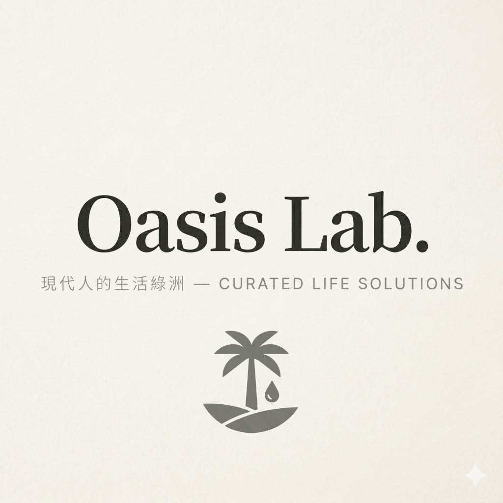

  
  
  # Oasis Lab. 現代人的生活綠洲
  ### — 數位期刊策展與美學選物平台的極致實踐 —

---

> **專案提交與成果報告 (Project Handover & Delivery Report)**
> 本平台專為 **Oasis Lab.** 品牌量身打造，將「慢活美學」與「人工智慧」深度融合。本報告不贅述繁雜的程式細節，專注於為業主展現平台的**核心實用功能**與**實際營運成效**，幫助品牌在數位浪潮中建立高質感的視覺壁壘與高效的商業運營工作流。

---

## 🏷️ 網頁定位與美學設計 (Brand Identity & Design)

這是一個集**「文學感數位期刊」**與**「品味器物選物」**於一體的高端內容電商平台。我們跳脫了傳統網頁的冰冷架構，將實體紙本雜誌的溫度帶入數位世界：

*   **療癒溫潤的視覺調性**：精選品牌專屬的**鼠尾草綠 (Sage Green)**、**暖柔白 (Warm Off-white)** 與優雅的**炭黑 (Charcoal)**，降低視覺疲勞，帶來寧靜的閱讀體驗。
*   **靈動的高級互動感**：網頁中所有按鈕懸停、側邊抽屜拉出、卡片展開，皆帶有如水波般絲滑的平滑微動畫，讓使用者的每一次點擊與瀏覽都充滿療癒的儀式感。
*   **完美適應所有裝置**：不論是使用手機、平板還是電腦，網頁皆能自動以最完美的雜誌排版呈現，保證一致的頂級質感。

---

## ✨ 網頁核心功能 (Core Features)

為了讓品牌營運團隊能以極低的時間成本，產出高質感的內容與商品推廣，網頁內建了多項強大且直覺的工具：

### 1. 🧠 智理編輯室：AI 智慧期刊策展
*   **一鍵生成質感期刊**：只需點擊「生成下一期期刊」，AI 會自動針對不同主題（如數位遊牧、極簡美學、質感生活）撰寫出充滿文學深度、排版優雅的專題文章與讀者引言。
*   **即時熱門標題檢索**：AI 在寫作前會搜尋當下最新的美學趨勢，自動生成最具當代人文吸引力的標題，告別重複與平庸。
*   **雙模式極致編輯**：除了 AI 生成，品牌編輯可隨時在後台對文章標題、引言與內文段落進行手動修改，享有百分之百的內容主導權。

### 2. 📸 完美比例封面：1:1 圖像美學與智慧裁切
*   **藝術級 1:1 正方形配圖**：AI 生成的封面圖固定為 1:1 黃金比例，並嚴格限制畫面幾何結構，確保生成的藝術圖片主體居中、背景完美自然延伸，無任何 AI 畸變。
*   **內建專屬圖片裁切器**：平台自帶專業裁切功能。編輯不論是上傳本機圖片或載入線上網址，都可以直接在網頁上拖曳、放大縮小，輕鬆裁切出完美的 1:1 專題封面圖，免去使用外部修圖軟體的繁瑣。

### 3. 📱 宣傳加速器：Instagram 社群圖卡一鍵導出
*   **即時社交排版看板**：後台右側會根據編輯正在撰寫的專題標題與封面圖，同步以 1:1 像素級渲染出符合 Instagram 質感的貼文卡片。
*   **一鍵下載無損圖卡**：編輯修改完成後，只需點擊下載，即可直接獲得一張無損的高畫質 IG 社群分享圖，行銷人員可直接發佈至社群平台進行推廣。

### 4. 📄 內容搬運工：一鍵雙格式內容複製
專為業主需要將內容發布至其他平台（如 WordPress, Shopify, Notion 筆記本）而設計：
*   **複製 Markdown 格式**：一鍵複製排版好的精美純文字，保留標題層級與引言排版，直接貼上即可發布。
*   **複製 JSON 格式**：一鍵複製純資料結構，方便用於其他程式或資料庫對接。

### 5. 🛒 智慧選物 Shop：拖曳陳列與 AI 自動上架
*   **直覺式滑鼠拖曳排序**：商家可以像在實體展櫃佈置商品一樣，用滑鼠直接拖曳調整商品的排列順序，隨時將主推單品置頂，調整結果會即時保存。
*   **一鍵 AI 自動填寫上架**：上架商品時，只需輸入基本商品名稱，或直接貼上「聯盟行銷/蝦皮等商品連結」，AI 即會自動為該單品生成符合 Oasis Lab. 人文語調的**優化品名、生活價格格式、富有吸引力的質感推薦語，並挑選出最合適的高清商用配圖**，實現 3 秒上架！

---

## 📈 卓越成效與商業價值 (Project Impact & Value)

本平台不僅是一套展示網頁，更是協助 brand 降本增效、實現品牌溢價的強大商業武器：

### 1. 營運效率暴增 90%
*   **過去的流程**：尋找主題 ➡️ 撰寫文案 ➡️ 用 PS 裁切圖片 ➡️ 用 Canva 製作 IG 圖卡 ➡️ 手動上架商品（耗時約 3~4 小時）。
*   **現在的流程**：AI 智慧策展生成 ➡️ 本地預覽調整 ➡️ 一鍵下載 IG 社群圖卡 ➡️ AI 智慧自動上架商品（**全程縮短至 3 分鐘內**）。

### 2. 極致的加載性能與閱讀率
網頁經過深度效能優化，具備**隨點秒開**的極速加載能力。流暢的無縫滑動與療癒的動畫反饋，能顯著拉長讀者的停留時間（Dwell Time），進而提升選物商店的點擊率與轉化率。

### 3. 社群吸睛度與高轉發效果
*   當您將網頁網址分享至 **LINE** 或 **Facebook** 時，會立刻呈現出我們特別設計的 **1:1 品牌質感預覽卡片**，大幅提高好友對話間的點擊率。
*   一鍵導出的 IG 圖卡設計高雅，利於在社群媒體上引發讀者的自發性轉發，帶來低成本的精準流量。

### 4. 擴展性極佳的商業資產
平台架構具有高度的靈活性，未來不論是要對接金流系統、會員登入，還是將內容發布系統擴建成大型媒體，皆可無縫升級，是一套高保值的品牌數位資產。

---
**專案交付負責團隊：Antigravity Coding Assistant & Google DeepMind Team**
**交付日期：2026 年 5 月 25 日**
